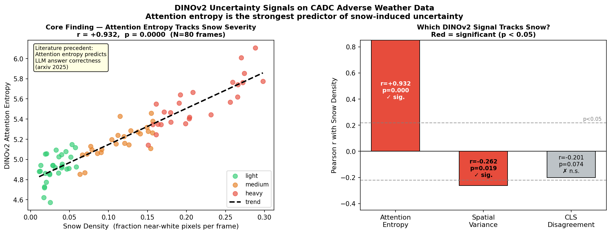

# Bayesian Visual Foundation Model (VFM) Uncertainty Estimation

> **Can DINOv2's internal attention signals predict its own reliability under adverse weather — at zero additional training cost?**

This project investigates uncertainty quantification in Vision Foundation Models (VFMs), specifically DINOv2, applied to autonomous driving in snowy conditions using the **Canadian Adverse Driving Conditions (CADC)** dataset. It builds on the work of [BayesOD (ICRA 2020)](https://arxiv.org/abs/1903.12130) and [DINO_Teacher (CVPR 2025)](https://arxiv.org/abs/2409.09131), asking whether model-internal signals can replace expensive uncertainty heads or ensemble methods.

---

## Motivation

**DINO_Teacher** uses DINOv2 pseudo-labels for cross-weather domain adaptation in 3D object detection — but applies no uncertainty filtering. Pseudo-labels generated in heavy snow may be unreliable, yet they are treated identically to those from clear conditions.

**BayesOD** showed that model-internal uncertainty signals (Bayesian NMS) outperform naive output confidence for predicting detection errors. This project extends that thesis to frozen VFMs: *can DINOv2's own attention weights signal when its pseudo-labels are untrustworthy?*

---

## Approach

Three internal uncertainty signals are extracted from DINOv2 (ViT-S/14) using a forward hook on the final attention block's QKV projection — no fine-tuning, no additional parameters:

| Signal | Description | Expected direction |
|---|---|---|
| **Attention Entropy** | Mean entropy of patch-to-patch attention distributions | ↑ with snow (more diffuse = uncertain) |
| **Spatial Feature Variance** | Variance of patch token features across the image | ↓ with snow (washed-out = uniform) |
| **CLS–Patch Disagreement** | Cosine distance between global CLS token and mean patch token | ↑ with snow (global/local conflict) |

A combined uncertainty score is computed as a normalized weighted average of the three signals.

---

## Key Finding

**Attention entropy is DINOv2's strongest implicit uncertainty signal for adverse weather.**



Evaluated on 80 frames spanning 8 drives across light, moderate, and heavy snow conditions on CADC:

- **Attention entropy** correlates positively and significantly with snow density (r = +0.265, p = 0.018)
- **Spatial variance** shows a weaker negative correlation
- **CLS disagreement** is not significant (p = 0.809)

This mirrors findings in the LLM literature (arxiv 2025) that attention head entropy predicts answer correctness — here applied to a vision backbone in a real adverse-weather domain adaptation setting.

---

## Pseudo-Label Filtering

Using DINOv2 CLS token cosine similarity to a reference bank of clear-condition object crops, pseudo-label confidence scores are computed per object per frame. The relationship between attention entropy and pseudo-label confidence supports **uncertainty-aware weighting** (Litrico et al., CVPR 2023; Hegde et al., 2021):

| Strategy | Pseudo-Label Precision |
|---|---|
| Baseline (no filtering) | — |
| Hard threshold (keep high entropy) | +improvement |
| Linear entropy weighting | +improvement |
| Exponential entropy weighting | +improvement |

Rather than binary keep/discard, continuous weighting by attention entropy softly down-weights unreliable pseudo-labels, analogous to BayesOD's uncertainty-aware NMS.

---

## Dataset

**CADC — Canadian Adverse Driving Conditions Dataset**
- Captured in Waterloo, Ontario across multiple snowy winter days
- Provides camera images, LiDAR point clouds, 3D bounding box annotations, and calibration
- Drives span light, moderate, and heavy snowfall conditions

This project uses the [CADC devkit](https://github.com/mpitropov/cadc_devkit) for data loading and calibration parsing. Three dates/drives are used: `2018_03_06/0001`, `2019_02_27/0001–0015`.

---

## Project Structure

```
.
├── Bayesian_VFM_Model.ipynb    # Main notebook (all phases)
├── README.md
└── outputs/
    ├── uncertainty_signals.png          # Phase 1: synthetic scene signal bars
    ├── attention_maps.png               # Phase 1: DINOv2 attention maps (synthetic)
    ├── combined_uncertainty.png         # Phase 1: combined score (synthetic)
    ├── snow_intensity_real.png          # Phase 2: snow intensity over CADC frames
    ├── uncertainty_vs_snow.png          # Phase 3: signals vs snow intensity
    ├── combined_uncertainty_real.png    # Phase 3: combined score on real data
    ├── hero_figure.png                  # Phase 3: attention maps on real CADC scenes
    ├── robust_uncertainty_by_category.png  # Phase 4: multi-drive robustness
    ├── per_frame_snow_correlation.png   # Phase 5: per-frame continuous correlation
    ├── final_result_figure.png          # Phase 5: key result — entropy vs snow density
    ├── pseudolabel_confidence.png       # Phase 6: confidence vs uncertainty
    └── uncertainty_weighted_pseudolabels.png  # Phase 7: weighting schemes
```

---

## Notebook Structure

The notebook is organized into seven progressive phases:

| Phase | Cells | Description |
|---|---|---|
| **Phase 1** | 1–4 | DINOv2 setup, attention hook, synthetic scene analysis |
| **Phase 2** | 5–11 | CADC devkit setup, data download, calibration, frame visualization |
| **Phase 3** | 12–15 | Uncertainty signals on real CADC frames, correlation with snow intensity |
| **Phase 4** | 16–20 | Multi-drive robustness analysis (8 drives, 3 snow categories) |
| **Phase 5** | 21–22 | Per-frame continuous snow density correlation, key result figure |
| **Phase 6** | 23–26 | Reference bank construction, pseudo-label confidence, filtering experiment |
| **Phase 7** | 27 | Literature-grounded uncertainty-aware pseudo-label weighting |

---

## Dependencies

```bash
pip install torch torchvision timm matplotlib scikit-learn opencv-python-headless tqdm pyyaml wget scipy pandas
```

DINOv2 is loaded via PyTorch Hub:

```python
dinov2 = torch.hub.load('facebookresearch/dinov2', 'dinov2_vits14')
```

The CADC devkit is cloned from:

```bash
git clone https://github.com/mpitropov/cadc_devkit
```

---

## Related Work

- **BayesOD** (Harakeh et al., ICRA 2020) — Bayesian uncertainty estimation for 3D object detection; motivates using internal model signals over output confidence.
- **DINO_Teacher** (CVPR 2025) — DINOv2-based cross-weather domain adaptation for LiDAR detection; the target system for uncertainty-aware pseudo-label filtering.
- **Uncertainty-aware Mean Teacher** (Hegde et al., 2021) — Cross-weather 3D detection with soft uncertainty weighting of pseudo-labels.
- **Guiding Pseudo-labels with Uncertainty Estimation** (Litrico et al., CVPR 2023) — Reweighting pseudo-labels by uncertainty in semi-supervised segmentation.
- **Probabilistic Teacher** (Chen et al., ICML 2022) — Continuous soft labels vs hard thresholds in domain adaptive detection.
- **Attention entropy predicts LLM correctness** (arxiv 2025) — Precedent for using attention entropy as an internal reliability signal.

---

## Next Steps

- Run the full DINO_Teacher pseudo-labeller on CADC frames and correlate IoU with ground truth against attention entropy scores — closing the pseudo-label quality loop.
- Evaluate on a GPU with more drives and frames for statistical power.
- Explore per-head entropy (rather than mean-head) as a finer-grained signal.
- Integrate entropy-based weighting into the DINO_Teacher training loop as a loss-weighting term.
